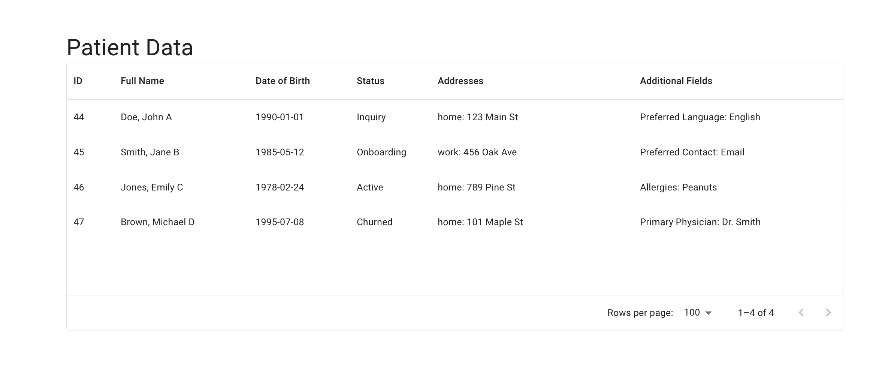
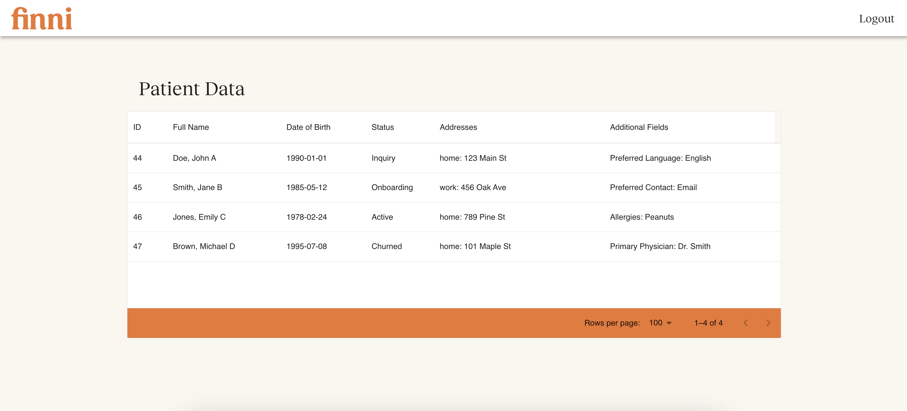

# Documentation

## Step 1 - Gathering requirements:

After reviewing the prompt for the take-home project, I asked several questions to clarify the project requirements. I was informed that seeding the database is acceptable and that the data should be clearly presented for clinical use, with no specific design guidelines. There are no particular format requirements for data storage, and patients can have at least one address and phone number, with a maximum of two phone numbers but no limit on addresses. For searches and filters, a full equality match and single-option filters are the minimum requirements, though more advanced features are welcome. Configurable forms have no limits on the types or number of custom fields. The application should be designed for desktop use only.

With these clarifications, I began building a web-based application using Next JS, ensuring it meets the outlined requirements while balancing functionality, code quality, robustness, feature completeness, and design.

## Step 2 - Initial set up

I started by initializing a new Next.js project with TypeScript support using `create-next-app`. Next, I installed the necessary dependencies for SQLite, MUI, SWR, and Prettier. I chose SQLite because it is practical for a small take-home project due to its serverless, self-contained nature and lack of configuration requirements. This simplicity allows it to be easily configured and run locally, enabling me to focus on the breadth of the project. I set up SQLite by creating the database and migration files, ensuring the correct paths were specified.

I used MUI as my UI kit because I was familiar with it and knew I would want to use the MUI data grid for its configurable form capabilities. I customized `_app.tsx` to include MUI's theme provider. Then, I created a custom hook for data fetching using SWR to keep the code cleaner and more maintainable. I used Prettier for linting to ensure my code was clear and readable. Prettier was configured with a `.prettierrc` file and a script in `package.json` to format the code.

Given my limited time, I wanted to make sure my setup worked before delving further into data formatting and seeding. I added a single line of sample data to verify that data could be successfully retrieved from the database to the client. Throughout the process, I ensured proper paths and configurations, and after troubleshooting and adjustments, I successfully ran the development server to verify the setup. This was a good stopping point for the day and I planned to continue on with the data model and seeding the database.

## Step 3 - Patient table migration and seeding

I added a migration to create a `patients` table in the database and a seed script to populate it with sample data. I chose to store the `addresses` and `additional_fields` as JSON to avoid creating additional tables and unnecessary joins.

```sql
CREATE TABLE IF NOT EXISTS patients (
  id INTEGER PRIMARY KEY AUTOINCREMENT,
  first_name TEXT NOT NULL,
  middle_name TEXT,
  last_name TEXT NOT NULL,
  date_of_birth TEXT NOT NULL,
  status TEXT CHECK(status IN ('Inquiry', 'Onboarding', 'Active', 'Churned')) NOT NULL,
  addresses JSON,
  additional_fields JSON
);
```

## Step 4 - Display patient data in data table

I displayed the data using a MUI DataGrid. The columns are populated based on the specified fields. The first, middle, and last names are aggregated into one column, and additional fields are grouped into a separate column. Then, I customized the theme of the grid using the logo, fonts, and colors from FiniHealth.com.




